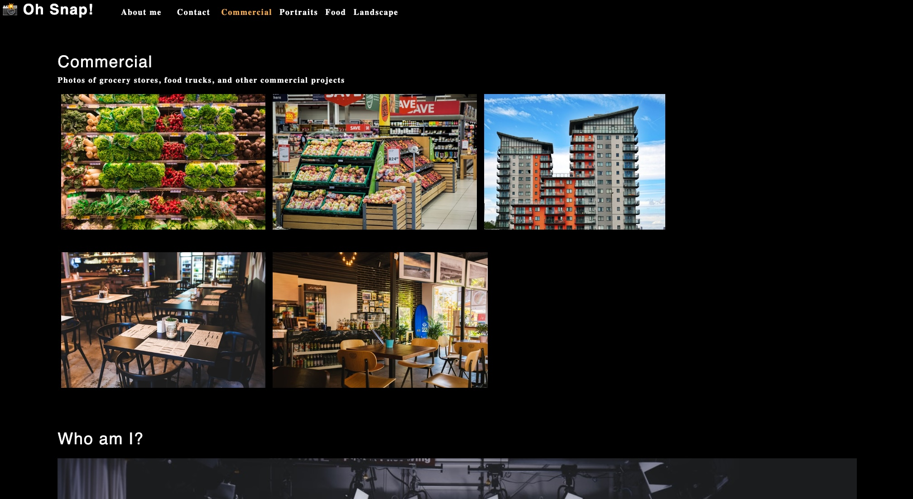
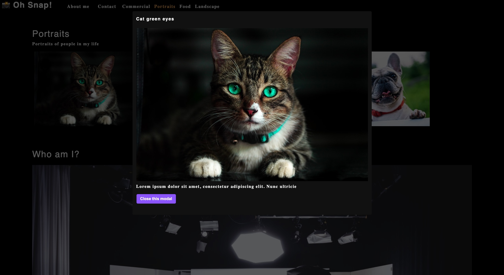

# React Photo Port

This is a simple photographer advertisement website built using React to display the artist's photos in galleries to hopefully attract customers and their business. 

Photos are separated in categories for the user to click in the navigation bar. Users can also click on the photos to enlarge the selection.

The contact form grabs data and records it in the console. This is a complete front end project.

Link: https://cesarsiguencia.github.io/react-photo-port/

### Screenshots

